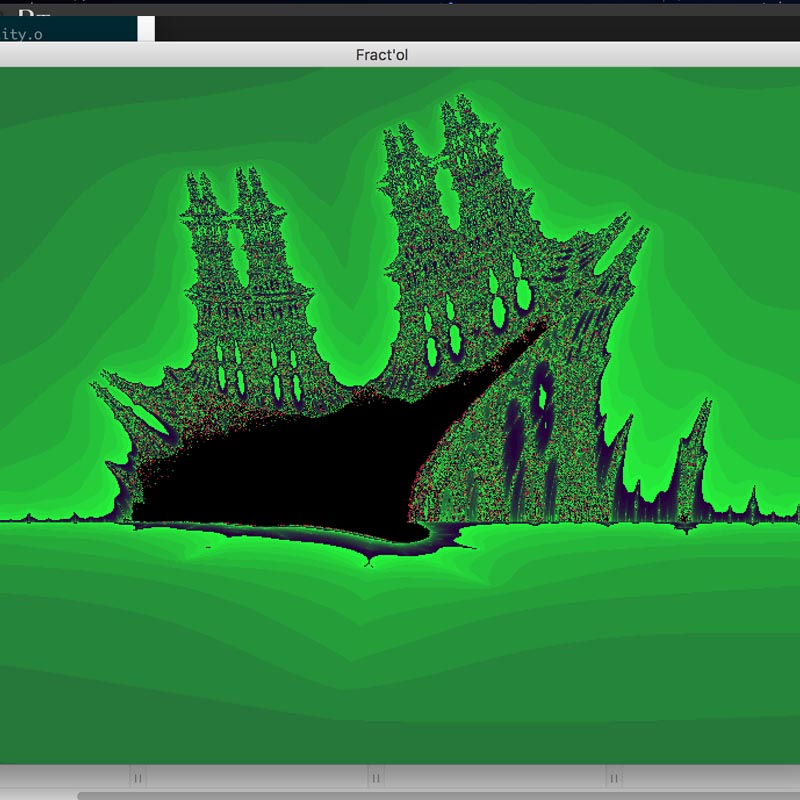

# Fractol

Fractol is an fractal explorer written in C and using 42 own graphic library (Mini Lib X)

## Usage

Use ./fractol [Mandelbrot][Julia][BurningShip]

Control are displayed on the interface.

## Preview
